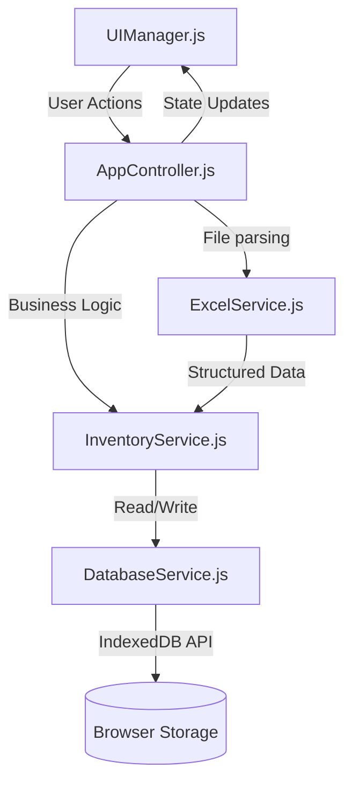

# Software Architecture - Mega Ensambles WMS

## System Overview
Mega Ensambles WMS is built entirely on a **Local-First Architecture** utilizing Vanilla JavaScript, CSS3, and HTML5. By intentionally removing the backend dependency, the system eliminates network latency, guarantees 100% offline uptime, and ensures maximum corporate data privacy (as inventory ledgers never leave the browser execution context).

## Core Architectural Patterns
The application strictly implements the **MVC (Model-View-Controller)** design pattern coupled with **SOLID principles** to maintain modularity in a framework-less environment.

## Component Deep Dive

### 1. View Layer (`UIManager.js`)
Handles all DOM manipulations, event listener attachments, and responsive rendering. 
- Implements **Virtual Scrolling / Pagination** heuristics to manage thousands of rows without crashing the DOM.
- Follows **Fitts's Law** for button placement and **Hick's Law** for menu simplification.

### 2. Controller Layer (`AppController.js`)
Acts as the central orchestrator. It listens to UI events, sanitizes inputs, and routes requests to the appropriate service. It ensures the View never directly mutates the Model.

### 3. Service Layer (Models)
- **`InventoryService.js`**: Contains the core business logic. Recalculates stock balances, identifies discrepancies between physical counts and theoretical stock, and handles state mutations.
- **`DatabaseService.js`**: An asynchronous wrapper around the native `IndexedDB` API. It provides a clean Promise-based interface for CRUD operations, handling cursor iterations and transactional integrity.
- **`ExcelService.js`**: Integrates `SheetJS` to read raw `.xlsx` buffers in memory, mapping messy logistical columns into structured JSON objects.

## Data Flow: Inventory Import
1. User uploads the raw Asian supplier manifest.
2. `ExcelService` reads the binary blob asynchronously.
3. `InventoryService` compares the incoming SKUs against the local IndexedDB master catalog.
4. Heuristics are applied to fix factory typos via an internal Alias Dictionary.
5. `DatabaseService` commits the transaction to update local stock.
6. `UIManager` repaints the data grid.

## Security & Persistence
All data is stored locally in IndexedDB. Security is inherently governed by the host operating system's user isolation and browser sandboxing.
